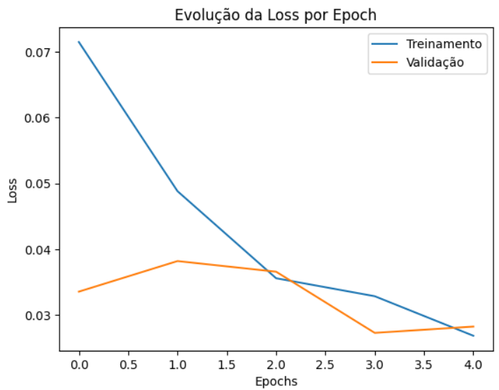
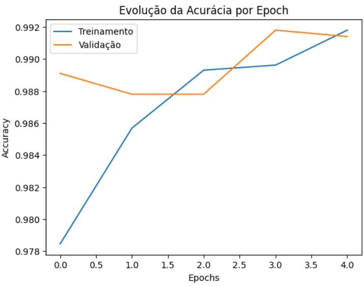

# Reconhecimento de Dígitos MNIST com CNN (TensorFlow/Keras)
Uma implementação de uma Rede Neural Convolucional para classificar os dígitos da base de dados MNIST.

## 🎯 **Objetivo**
Construir e treinar uma CNN para atingir alta precisão na classificação de imagens de dígitos manuscritos (0 a 9).

## 📊 **Base de Dados – MNIST**
O **MNIST** é um conjunto de dados clássico de aprendizado de máquina, composto por:

- **60.000 imagens de treino** (28x28 pixels, escala de cinza)

- **10.000 imagens de teste**

Dígitos manuscritos entre 0 e 9

## 🏗️ **Arquitetura da CNN**

A rede convolucional desenvolvida segue a seguinte estrutura:

1) Camada de Convolução (32 filtros, 3x3, ReLU)

2) MaxPooling (2x2)

3) Camada de Convolução (64 filtros, 3x3, ReLU)

4) MaxPooling (2x2)

5) Flatten (achata os mapas de características)

6) Camada Densa (128 neurônios, ReLU)

7) Dropout (0.5 para reduzir overfitting)

8) Camada de Saída (10 neurônios, Softmax)

## **Tecnologias Utilizadas** 
As principais ferramentas utilizadas para o treinamento da CNN.

- **Linguagem:** Python

- **Frameworks:** TensorFlow, Keras

- **Bibliotecas:** NumPy, Matplotlib

## 📈 **Resultados**

**Precisão Alcançada:** Precisão de 98.9% no conjunto de testes.

