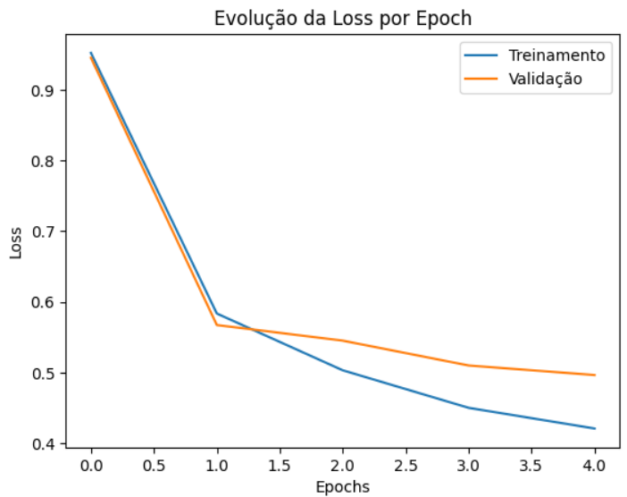
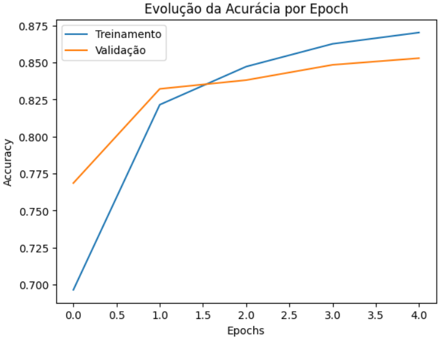

# **Reconhecimento de Dígitos SVHN com CNN (TensorFlow/Keras)**

Uma implementação de uma Rede Neural Convolucional para classificar os dígitos da base de dados SVHN (Street View House Numbers).

## 🎯 **Objetivo**
O objetivo deste projeto é construir e treinar uma CNN robusta capaz de classificar com alta precisão os dígitos de placas de casas extraídos de imagens do Google Street View.

## 📊 **Base de Dados – SVHN (Street View House Numbers)**
O SVHN é um conjunto de dados mais complexo que o MNIST, contendo imagens de dígitos do mundo real, muitas vezes com ruído, diferentes ângulos e iluminação. Ele é composto por:

- **73.257 imagens de treino** (32x32 pixels, coloridas - RGB)

- **26.032 imagens de teste**

- **Dígitos de 0 a 9** (onde o dígito '0' é rotulado como '10' na base de dados original, mas foi ajustado para '0' neste projeto)

## 🏗️ **Arquitetura da CNN**
A rede convolucional foi projetada para lidar com a complexidade das imagens coloridas e do mundo real. A arquitetura segue a seguinte estrutura:

1) Pré-processamento: As imagens coloridas (RGB) são convertidas para escala de cinza e normalizadas.

2) Camada de Convolução (32 filtros, 3x3, ReLU)

3) Normalização em Batch (BatchNormalization)

4) MaxPooling (2x2)

5) Flatten (achata os mapas de características)

6) Camada Densa (128 neurônios, ReLU)

7) Dropout (0.2 para reduzir overfitting)

8) Camada Densa (128 neurônios, ReLU)

9) Dropout (0.2 para reduzir overfitting)

10) Camada de Saída (10 neurônios, Softmax)

## **Tecnologias Utilizadas**
As principais ferramentas e bibliotecas utilizadas para o desenvolvimento e treinamento da CNN.

- **Linguagem:** Python

- **Frameworks:** TensorFlow, Keras

- **Bibliotecas:** NumPy, SciPy (para carregar arquivos .mat), Matplotlib

## 📈 **Resultados**
**Precisão Alcançada:**  85.3% no conjunto de testes.

